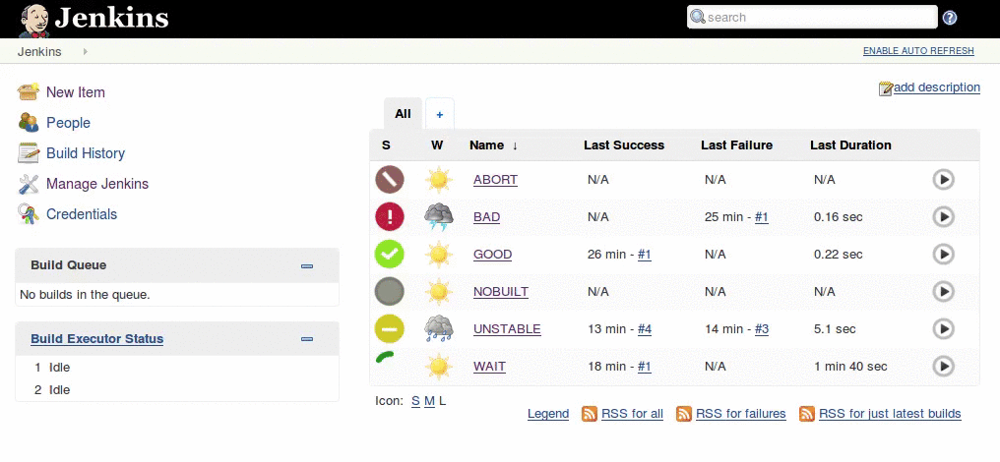

# Modern Status for Jenkins 

Providing a modern look to Jenkins Status indicators. 

## Build Status Icons

Status | Build Finished | Build in Progress
------ | -------------- | -----------------
No Build |  | 
Disabled Build |  | 
Successful Build |  | 
Unstable Build |  | 
Failed Build |  | 
Aborted Build |  | 

## Project Icons

Action | Icon
------ | ----
Build Now | 
Delete Project | 
Workspace | 
